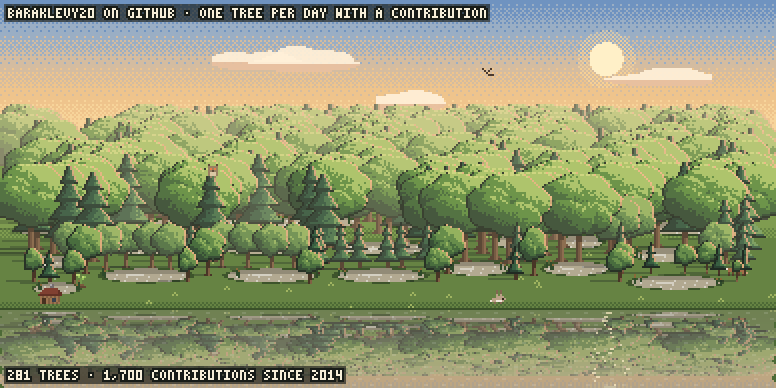
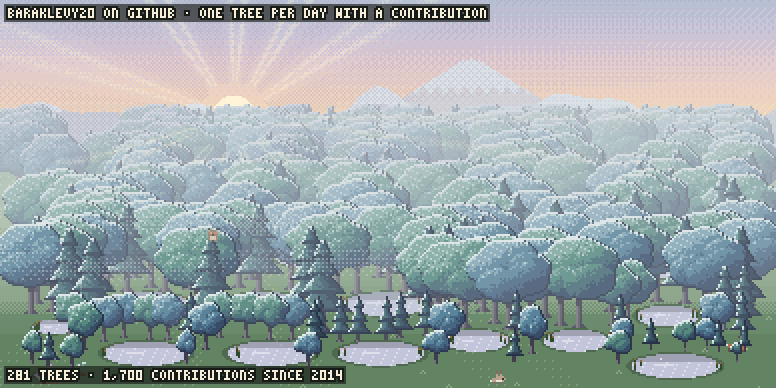
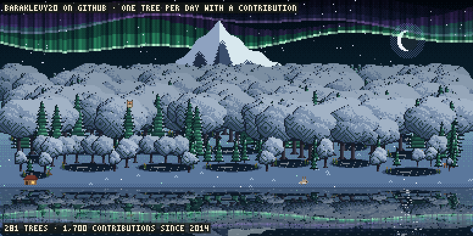
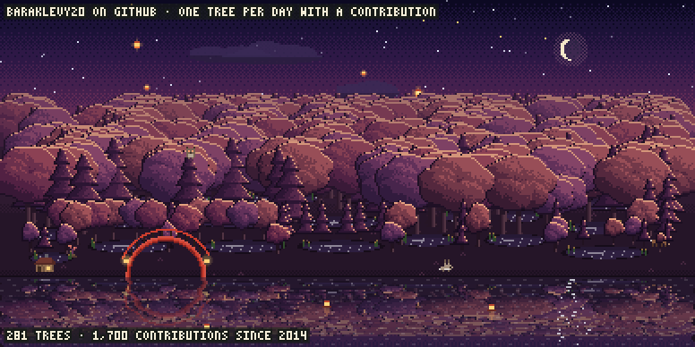
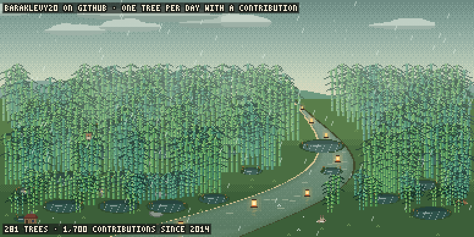
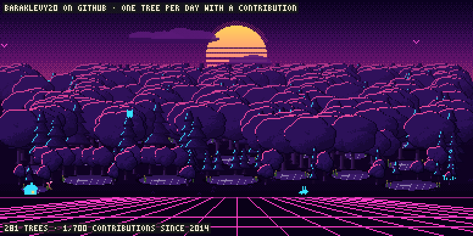

# Commit Forest

A pixel forest for your GitHub profile. Every day you contribute plants a tree. Trees grow
older with you, a break of two weeks or more becomes a pond, and nothing ever dies.

<p align="center"></p>

**[See your own forest](https://baraklevy20.github.io/commit-forest/)**: type your username,
try the sceneries, and copy the workflow it gives you.

The forest is drawn by the engine of [Memory Forest](https://ankiweb.net/shared/info/1255432496),
an Anki add-on where study days grow the same trees.

## Set it up

You need a profile repository: a public repository named after your username, such as
`octocat/octocat`. Its README is shown on your profile.

1. In that repository, add `.github/workflows/forest.yml` with this in it, and commit it:

   ```yaml
   name: forest
   on:
     schedule: [{ cron: "17 4 * * *" }]   # once a day, in UTC
     workflow_dispatch:                   # adds a "Run workflow" button
     push: { paths: [.github/workflows/forest.yml] }
   permissions:
     contents: write                      # to push the images to the output branch
   jobs:
     grow:
       runs-on: ubuntu-latest
       steps:
         - uses: baraklevy20/commit-forest@v1
   ```

2. The workflow runs when the file is committed and takes one to three minutes. Open
   Actions, then the latest "forest" run. Its summary has a snippet for your README.

3. Paste the snippet into README.md. It looks like this, with your username in place of
   `<you>`:

   ```html
   <a href="https://github.com/baraklevy20/commit-forest">
     <picture>
       <source media="(prefers-color-scheme: dark)" srcset="https://raw.githubusercontent.com/<you>/<you>/output/forest-dark.png">
       /<you>/output/forest.png">
     </picture>
   </a>
   ```

No token or secret is needed. If "Include private contributions" is on in your profile
settings, private work counts too, as numbers only.

## Sceneries

| | |
|---|---|
| <br>`golden_lake` | <br>`misty_valley` |
| <br>`aurora` | <br>`lanterns` |
| <br>`bamboo` | <br>`synthwave` |

## Settings

Add them under `with:` in the workflow.

| Input | Default | What it does |
|---|---|---|
| `scenery` | `golden_lake` | The scenery for light mode. One of the names above, `daily` for a different one each day, or `shuffle` for all of them in turn in one image. |
| `dark_scenery` | `aurora` | The scenery for dark mode, with the same choices. `""` for no dark image. |
| `sceneries` | `all` | Which sceneries `daily` and `shuffle` pick from, such as `aurora,lanterns,synthwave`. |
| `gallery` | none | Also draw one image per scenery, named `forest-<scenery>.png`. `all`, or a list such as `golden_lake,bamboo`. |
| `period` | `last-year` | `last-year` matches the calendar on your profile. `this-year` is the current calendar year. `all` is your whole history. A year such as `2025` shows that year. |
| `label` | `true` | The line at the top that says what the forest is: your username on GitHub, one tree per day with a contribution. `false` to hide it. |
| `stats` | `true` | The number of trees and contributions at the bottom. `false` to hide it. |
| `timezone` | none | Your time zone, such as `Europe/Berlin`. The light image then shows dawn, day, golden hour, dusk or night where you are. Set the schedule to `cron: "0 * * * *"` so it keeps up. |
| `format` | `apng` | `apng` (animated PNG), `gif`, or `png` (a still). GIF files are much larger, and with `gif` the file names end in `.gif`. |
| `user` | the repository owner | Whose contributions grow the forest. Set it to your username if the repository belongs to an organization. |
| `branch` | `output` | The branch the images go to. It is replaced on every run, so it can't be `main` or your default branch. |
| `token` | the workflow's token | Reads your contribution calendar and pushes the images. |
| `chrome` | found on its own | The path to Chrome, for runners other than `ubuntu-latest`. |

To show several sceneries side by side, set `gallery: all` and put the images in a table:

```html
<table><tr>
  <td>/<you>/output/forest-golden_lake.png"></td>
  <td>/<you>/output/forest-misty_valley.png"></td>
</tr></table>
```

`@v1` always points at the latest 1.x release, so fixes reach you without any change. To
stay on one release, use its full tag, such as `@v1.0.0`.

## How the forest grows

- One tree for each day with at least one contribution, as counted by your contribution calendar.
- Trees grow with age: a sapling, then young, mature, old, and ancient after a year.
- Your busiest days (the darkest squares on your calendar) grow broader crowns. How many
  commits you make doesn't matter: the darkest square is relative to your own history.
- Two weeks or more without a contribution leaves a pond.
- Animals move in: a rabbit at 50 trees, a deer at 100, a heron at the first pond, an owl
  at the first ancient tree, and a cabin when the forest turns one.
- Birds fly over a daytime sky, one for each contribution in the past day, up to six.
- The newest 730 trees are drawn one by one; older ones become the deep forest behind them
  (with `period: all`).
- The animation loops without a seam. Each loop is long enough for what crosses the scene
  to cross at its natural pace: a minute when there are birds and for the lanterns, ten
  seconds for bamboo's river lanterns, four seconds otherwise.

## Questions

**Nothing appeared after the first run.** Open the run's summary. It says why. The usual
causes are a misspelled scenery name or a missing `permissions: contents: write`.

**The run says it could not push.** Add `permissions: contents: write` to the workflow. If
it is there, open Settings, then Actions, then General, and set "Workflow permissions" to
"Read and write".

**My image didn't change.** GitHub caches images for up to 5 minutes. Scheduled runs can also
start hours after the time in the cron, which is in UTC. To redraw now, open Actions, pick
"forest", and click "Run workflow".

**I want it to run at another time.** Change the cron line. `"0 18 * * *"` runs at 18:00
UTC. [crontab.guru](https://crontab.guru) helps with the format.

**The workflow was turned off.** GitHub switches off scheduled workflows in public
repositories after 60 days without activity. Open Actions, pick "forest", and click
"Enable workflow".

**I don't see an owl or a cabin.** They come when a tree turns one year old and when the
forest turns one. With the default `period: last-year` that rarely happens. Use
`period: all`.

**I renamed my account.** Replace the old name in the image links in your README.
`user` follows the rename on its own.

**Do the forest's own commits count as contributions?** No. They are made by the Actions
bot on a separate branch.

## Remove it

1. Delete `.github/workflows/forest.yml`.
2. Remove the snippet from your README.
3. Delete the `output` branch: Branches, then the bin icon next to `output`.

## Development

```sh
npm install
npm run local -- --user <login>     # draws into out/, pushes nothing
npm test
npm run sync-engine                 # copies the engine from the Memory Forest add-on's last commit
npm run build                       # bundles the Action into dist/ and the preview page into docs/
```
